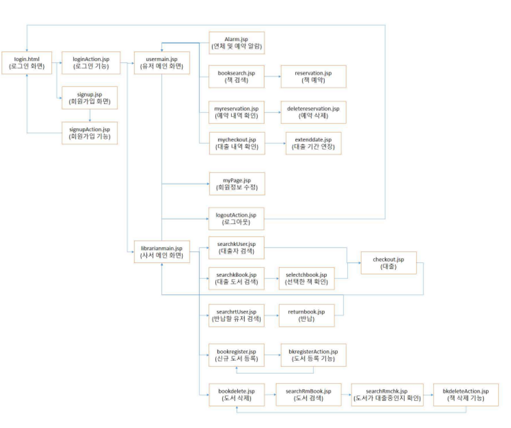

# Live-rary
- 본 과 컴퓨터공학과의 웹 프로그래밍 수업 기말 프로젝트 입니다.
- 교수님께 제출한 보고서와 ppt는 github에 포함되어 있습니다.

## Description
도서관에 가면 내가 찾는 책이 없거나 빌리려던 책이 이미 대출되어있는 경우가 종종 있습니다.

 만약 인터넷에서 미리 검색해서 책이 있는지, 대출 가능한지 확인할 수 있다면 헛걸음하는 일이 없을 것입니다.

 따라서 인터넷에서 해당 도서관의 소장 도서 목록을 확인할 수 있고, 도서 대출이 가능한지 확인할 수 있는 프로그램을 만들고자 합니다.

 또 내가 찾는 책이 누군가가 이미 대출을 해서 대출할 수 없다면 대출예약을 할 수 있고, 대출이 가능해졌을 때 알림을 표시해 주는 프로그램을 만들어 사용자가 어디서나 도서 대출 가능 여부를 편리하게 확인할 수 있게 만드는 것이 개발 목표입니다.

## Tech/Framework Used
- html, css, javascript, jsp, mysql
### built with
- eclipse

## Code

## Developer
- 김규빈: 회원 정보 관리(로그인, 회원가입, 마이페이지(수정, 탈퇴), 초기 레이아웃 구성 및 CSS 최종 수정, 책 검색, 오류 수정
- 진민주: 유저 화면(개인 유저 기능<알림(연체, 대출 가능 목록), 대출 목록(확인 및 연장), 예약 목록(확인 및 취소), 책 검색(예약하기))
- 홍상혁: 사서 화면(대출, 반납, 신규 도서 등록, 책 삭제), 시나리오 작성

## 수행한 것 정리
https://github.com/freenozero/Live-rary/wiki/%EC%88%98%ED%96%89-%EB%AA%A9%EB%A1%9D
